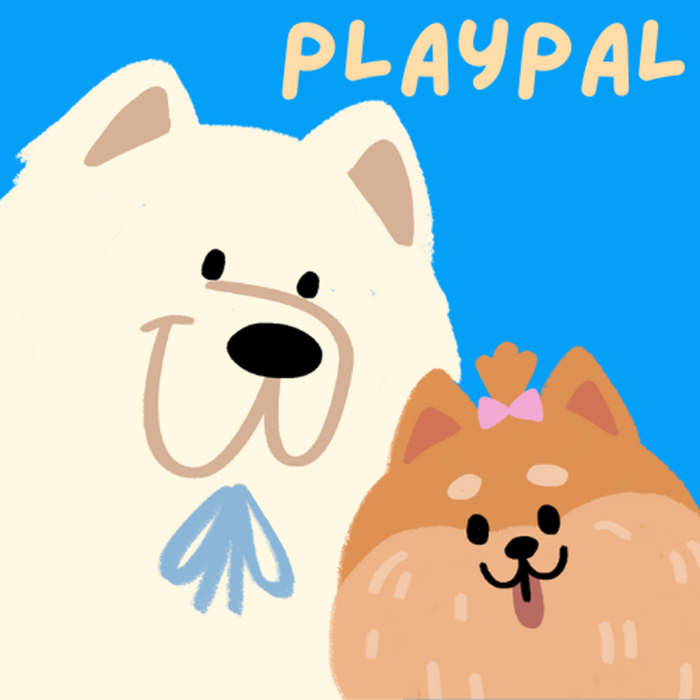

<a name="readme-top"></a>

<!-- PROJECT LOGO -->
<br />
<div align="center">
  <a href="https://github.com/apphamd/playpal">
    
  </a>

<h3 align="center">PlayPal</h3>

  <p align="center">
    A way to find a friend for your friend.
    <br />
    <a href="https://github.com/apphamd/playpal"><strong>Explore the docs »</strong></a>
    <br />
    <br />
    <a href="https://github.com/apphamd/playpal">View Demo</a>
    ·
    <a href="https://github.com/apphamd/playpal/issues/new?labels=bug&template=bug-report---.md">Report Bug</a>
    ·
    <a href="https://github.com/apphamd/playpal/issues/new?labels=enhancement&template=feature-request---.md">Request Feature</a>
  </p>

  [![Flutter][Flutter.dev]][Flutter-url]
  [![Flutter][Google.firebase.com]][Firebase-url]
</div>


<!-- TABLE OF CONTENTS -->
<details>
  <summary>Table of Contents</summary>
  <ol>
    <li>
      <a href="#about-the-project">About The Project</a>
      <ul>
        <li><a href="#built-with">Built With</a></li>
      </ul>
    </li>
    <li>
      <a href="#getting-started">Getting Started</a>
      <ul>
        <li><a href="#prerequisites">Prerequisites</a></li>
        <li><a href="#installation">Installation</a></li>
      </ul>
    </li>
    <li><a href="#usage">Usage</a></li>
    <li><a href="#contact">Contact</a></li>
  </ol>
</details>


<!-- ABOUT THE PROJECT -->
## About The Project

PlayPal is a mobile application designed to connect dog owners, fostering a community where they can:

* **Establish connections**: Facilitate introductions between dog owners in your area, allowing your furry companions to build friendships.
* **Streamlined communication:** Enable dog owners to chat and exchange messages, making it easier to coordinate play dates and socialize their dogs.
* **Organized play dates**: Provide a platform for scheduling play dates that cater to the specific needs and temperaments of your dogs.

[![PlayPal Screen Shot][product-screenshot]](https://example.com)

<p align="right">(<a href="#readme-top">back to top</a>)</p>

<!-- GETTING STARTED -->
## Getting Started

### Prerequisites

This is an example of how to list things you need to use the software and how to install them.

* Flutter - <a href="https://docs.flutter.dev/get-started/install">Download & Install Flutter.</a>
* Firebase CLI - <a href="https://firebase.google.com/docs/cli#setup_update_cli">Download & Install Firebase CLI</a>
* Firebase - <a href="https://console.firebase.google.com/u/0/">Setup Firebase Project</a>
* Cocoapods (for iOS and macOS development) - <a href="https://guides.cocoapods.org/using/getting-started.html">Download & Install CocoaPods</a>
* Xcode (for iOS and macOS development) - <a href="https://apps.apple.com/us/app/xcode/id497799835?mt=12">Download & Install Xcode</a>
* Android Studio (for Android development) - <a href="https://developer.android.com/studio">Download & Install Android Studio</a>


### Installation

1. Clone the repo
   ```sh
   git clone https://github.com/apphamd/playpal.git
   ```
2. Install Flutter packages
   ```sh
   flutter pub get
   ```
3. Update dependencies
    * If developing for iOS:
      1. Change directory to the ios folder
            
          ```sh
            cd ios
          ```

      2. Update Cocoapod dependencies
          ```
            pod install --repo-update
          ```

  * If developing for Android (coming soon)

4. Setup a <a href="https://console.firebase.google.com/">Firebase project</a>
   * For this project specifically, you want to set up Firestore, Authentication, and Storage.
   * For Authentication, the only sign-in provider should be email/password. More coming soon in future updates.
5. Navigate to your project settings
![firebase-screenshot]
6. Under your apps in the general tab, select the platform you want to develop on.
![your-apps-screenshot]
7. Register your app then download the GoogleService-Info.plist file.
8. Drag your GoogleService-Info.plist file into ios/Runner.
9. Open lib/main.dart and start debugging to run the app!

<p align="right">(<a href="#readme-top">back to top</a>)</p>


<!-- USAGE EXAMPLES -->
## Usage

Use this space to show useful examples of how a project can be used. Additional screenshots, code examples and demos work well in this space. You may also link to more resources.

<p align="right">(<a href="#readme-top">back to top</a>)</p>


## Contact

Albert Pham-Dao
<br><br>
[![LinkedIn][linkedin-shield]][linkedin-url]

<!-- MARKDOWN LINKS & IMAGES -->
[linkedin-shield]: https://img.shields.io/badge/-LinkedIn-black.svg?style=for-the-badge&logo=linkedin&colorB=555
[linkedin-url]: www.linkedin.com/in/albert-pham-dao
[product-screenshot]: images/screenshot.jpg
[Flutter.dev]: https://img.shields.io/badge/Flutter-%2302569B.svg?style=for-the-badge&logo=Flutter&logoColor=white
[Flutter-url]: https://flutter.dev
[Google.firebase.com]: https://img.shields.io/badge/firebase-ffca28?style=for-the-badge&logo=firebase&logoColor=black
[Firebase-url]: https://firebase.google.com/ 
[firebase-screenshot]: images/firebase_console.png
[your-apps-screenshot]: images/your_apps.png
